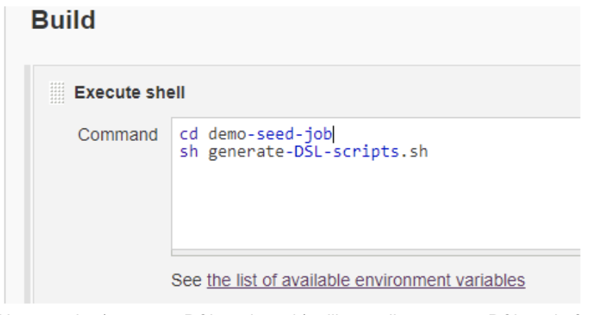
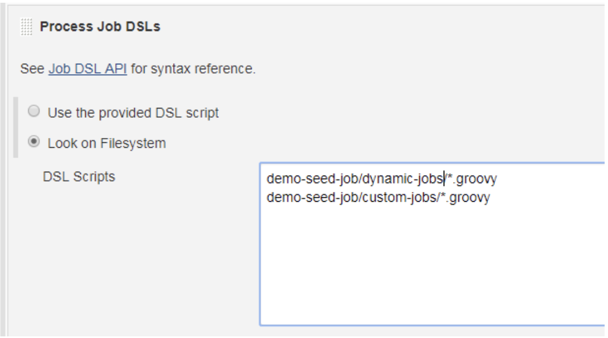
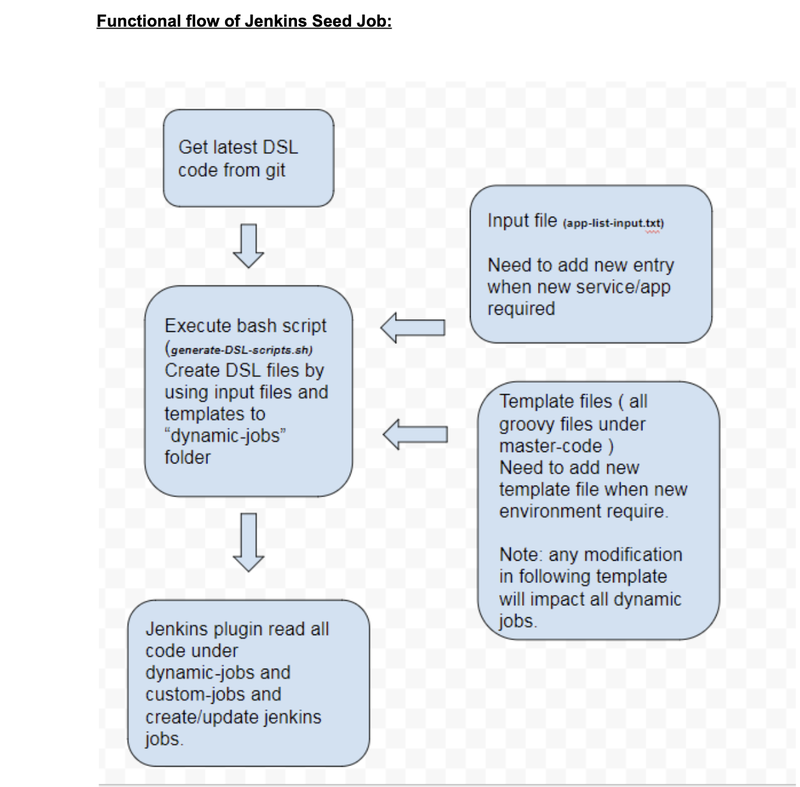
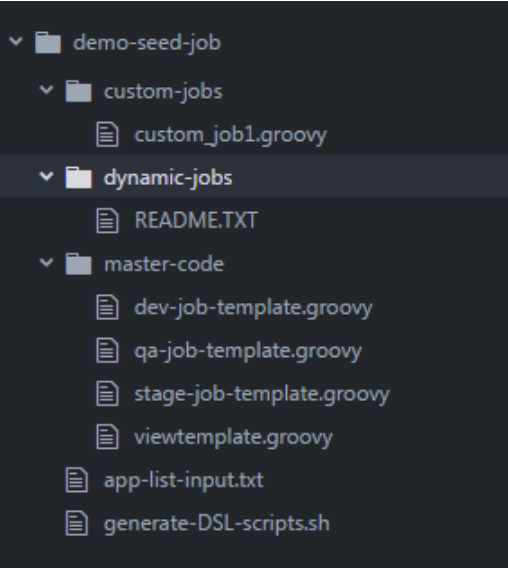

# jenkins-sample-dsl
Sample code of Jenkins DSL for Seed job
## How DSL plugin helps to setup Jenkins Jobs

If you are from DevOps, System Admin, Build and release engineer or dealing with Jenkins by any means then this sample code might be helpful for you.
In my case, we were in the initial phase of the project, every next day we needed to set up a new Jenkins build and deploy a job for fresh micro service. And moving ahead, now everything is promoted to a new environment ( like dev, QA , Stage ), again setup everything here, which are almost replicas of the previous environment. Probably, you are thinking of automating it through Jenkins cli, even though I did my initial automation by Jenkins cli with Ansible. Suddenly I went through the DSL plugin, I realized that is what I was looking for.

Before going forward, I’d like to highlight some points. If you find yourself around it, then this blog will be really helpful for you.

You are dealing with dozens of Jenkins jobs which are following the same set of steps, normally found in microservices based architecture.

You are in the early phase of your project, where frequent changes are required in all jobs. Like adding a new plugin, disable webhook ..etc.
Dealing with multiple clients/projects, where Jenkins job creation is quite frequent.

In case your every job has its own custom settings then I’ll won't recommend DSL for you unless you are a groovy lover.

Although a wide range of DSL functions are already available, few important functions are still unavailable, like enable webhook, sonar plugin etc. but don’t worry there are some workarounds to use functions which are not available. I’m going to show steps to create a seed job ( Jenkins Job which creates jobs through DSL ) and sample DSL code of Jenkins Job which will serve as a template through which we’ll generate multiple jobs.

Plugin require:
Job DSL Plugin (https://wiki.jenkins.io/display/JENKINS/Job+DSL+Plugin)

The very first thing for this, you must have your DSL code ready. You may use my sample code to understand concept and functionality, you may change further as per your requirement.

Note:

1: The main purpose of this sample code is to demonstrate concepts of DSL functionalities. So I have used some dummy values like git urls, git credentials, ECR repo URL, slaves names, email ids etc.

2:  Mentioned build steps are only for demo purposes please replace these as per your requirements. 

Steps to create Jenkins seed job.

1: Create a free style project in Jenkins.
2: Use my sample DSL code in scm settings.

3: Enable execute shell and add following command :
     cd demo-seed-job
     sh generate-DSL-scripts.sh

Above script (generate-DSL-scripts.sh) will actually generate DSL code for all required job from input files and templates.

3: Add another build step and enable “Process Job DSLs” and add following lines:
     demo-seed-job/dynamic-jobs/*.groovy
     demo-seed-job/custom-jobs/*.groovy
     

    
Plugin will read groovy code from the above path and create/update Jenkins jobs accordingly.

4: Leave the rest of the settings default.
5 : Save and exit.

 
  

## Functional flow of Jenkins Seed Job:

## Tree structure of sample code:

